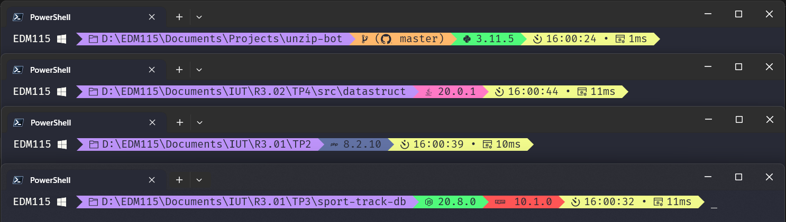
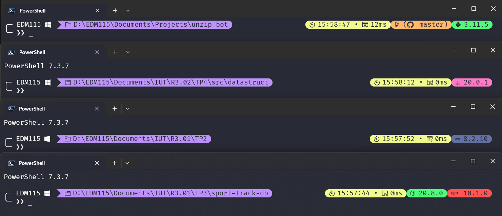

# EDM115-ohmyposh-theme

### My very own Oh My Posh theme

---

## Usage (for PowerShell) :

- Install [Oh My Posh](https://ohmyposh.dev/) (read the docs)
- Install a [Nerd Font](https://github.com/ryanoasis/nerd-fonts/)
- Set the font as default in your terminal ([tutorial by TroubleChute](https://www.youtube.com/watch?v=-G6GbXGo4wo))
- Add my themes in the themes folder (defaults to `%LOCALAPPDATA%\Programs\oh-my-posh\themes`)
- Edit your PowerShell profile script (`notepad $PROFILE`) and add this :
```powershell
$ErrorActionPreference = "SilentlyContinue"
Write-Host "PowerShell $($PSVersionTable.PSVersion.Major).$($PSVersionTable.PSVersion.Minor).$($PSVersionTable.PSVersion.Patch)"
Write-Host ""
$ErrorActionPreference = "Continue"

oh-my-posh init pwsh --config 'C:\Users\EDM115\AppData\Local\Programs\oh-my-posh\themes\EDM115.omp.json' | Invoke-Expression

```
Obviously change the config path, and the name depending of the theme you want

---

## Properties

- Both themes uses the [Dracula](https://draculatheme.com/) color scheme
- Included segments :
  - session
  - root
  - os
  - path
  - git
  - node
  - npm
  - java
  - php
  - python
  - time
  - executiontime
- Python shows even outside of a venv
- Time shows seconds
- Git have some changes :
  - Shows changes in the worktree (both staged and unstaged)
  - Links to the upstream (on the git provider icon)
  - Shows by how many commits we are ahead or behind the upstream
  - Shows the branch name
- Path shows the full path, not only the current folder

## But why 2 themes ?

The main theme I made is `EDM115.omp.json`  
It features all elements I wanted and is clean  
But after seing the work of [thecodermehedi](https://github.com/thecodermehedi/dualsimplicity-ohmyposh-theme) and [RainbowCreamPie](https://github.com/RainbowCreamPie/vietnam-omp-theme), I decided to create `EDM115-newline.omp.json`, which skips a line and shows unessential modules rounded on the right  

## Preview :

### EDM115 OneLine

  

### EDM115 NewLine

  

---

## Attribution :

These themes are licenced under the MIT License
Also, feel free to edit them, change colors, icons, modules, ...
