# EDM115-ohmyposh-theme

## My very own Oh My Posh theme

---

## Preview :

### EDM115 NewLine

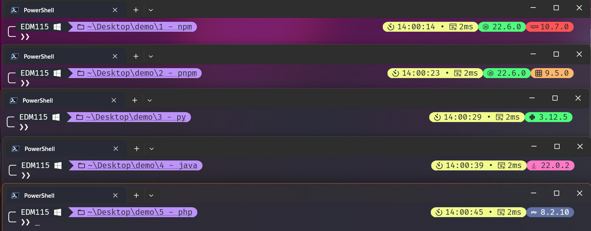  
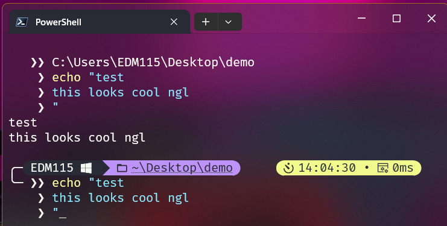

### EDM115 OneLine

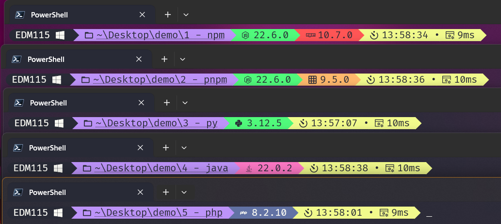  
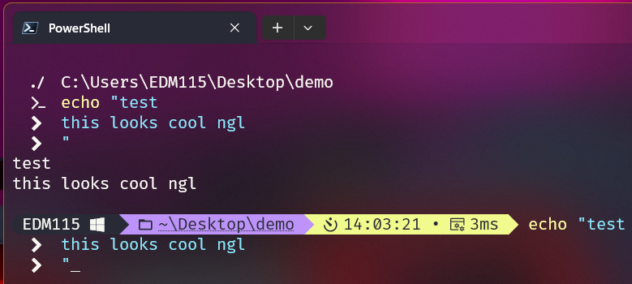

### Demo of a basic Git workflow (in NewLine)

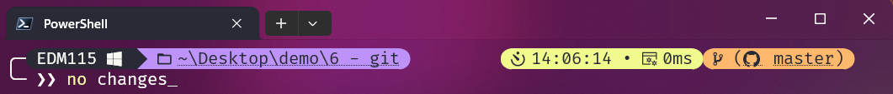  
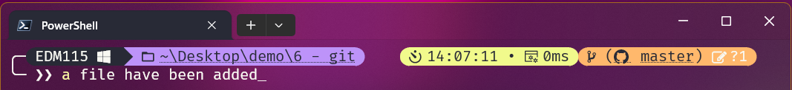  
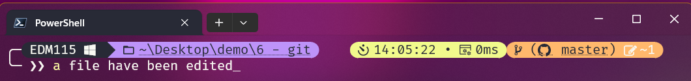  
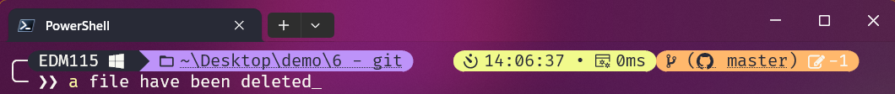  
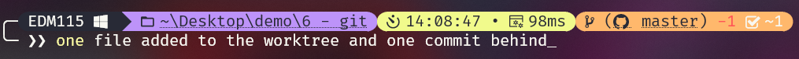  
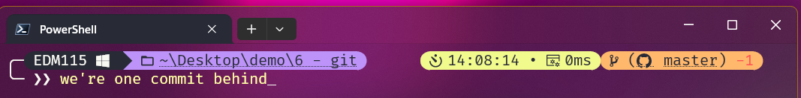  
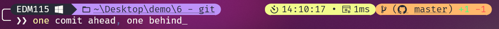  
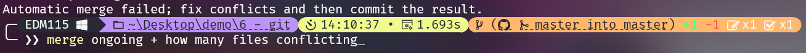

### Root status (in NewLine)

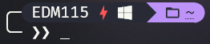

---

## Installation :

- Install [Oh My Posh](https://ohmyposh.dev/) (read the docs)
- Install a [Nerd Font](https://github.com/ryanoasis/nerd-fonts/)
- Set the font as default in your terminal ([tutorial by TroubleChute](https://www.youtube.com/watch?v=-G6GbXGo4wo))

### Windows (PowerShell)

- Add my themes in the themes folder (defaults to `%LOCALAPPDATA%\Programs\oh-my-posh\themes`)
- Edit your PowerShell profile script (`notepad $PROFILE`) and add this at the very top :

```powershell
$ErrorActionPreference = "SilentlyContinue"
Write-Host "PowerShell $($PSVersionTable.PSVersion.Major).$($PSVersionTable.PSVersion.Minor).$($PSVersionTable.PSVersion.Patch)"
Write-Host ""
$ErrorActionPreference = "Continue"

oh-my-posh init pwsh --config '%LOCALAPPDATA%\Programs\oh-my-posh\themes\EDM115-newline.omp.json' | Invoke-Expression
```

Obviously change the config path, and the name depending of the theme you want. The first 3 lines have to be at the very top, as they will suppress the annoying "theme took xx ms to load" message.

### Linux (Zsh)

- Add my themes in the themes folder (defaults to `~/.local/share/oh-my-posh/themes`)
- Edit your Zsh profile script (`nano ~/.zshrc`) and add this :

```zsh
# Oh My Posh
eval "$(oh-my-posh --init --shell zsh --config ~/.local/share/oh-my-posh/themes/EDM115-newline.omp.json)"
```

You can change the config path, and the name depending of the theme you want.

---

## Properties

- Both themes uses the [Dracula](https://draculatheme.com/) color scheme
- Included segments (in order) :
  - Session
  - Root
  - Os
  - Path
  - Git
  - Node
  - Npm
  - Pnpm
  - Python
  - Java
  - Docker
  - Php
  - Time
  - Executiontime
- Time shows seconds
- Python shows even outside of a venv
- Git have some changes :
  - Shows changes in the worktree (both staged and unstaged)
  - Links to the upstream (on the git provider icon and branch name)
  - Shows by how many commits we are ahead or behind the upstream (with proper colors)
  - Shows the branch name
- Path shows the full path, not only the current folder, and we can click on it to open the current folder in the file explorer
- The NPM and PNPM segments appear only when their respective lockfiles are present

## But why 2 themes ?

The first theme I made is `EDM115-oneline.omp.json`  
It features all elements I wanted and is clean  
But after seing the work of [thecodermehedi](https://github.com/thecodermehedi/dualsimplicity-ohmyposh-theme) and [RainbowCreamPie](https://github.com/RainbowCreamPie/vietnam-omp-theme), I decided to create `EDM115-newline.omp.json`, which skips a line and shows unessential modules rounded on the right. It is now the theme I use daily

---

## Attribution :

These themes are licenced under the MIT License  
Also, feel free to edit them, change colors, icons, modules, ...  
Comment on the [issue #3](https://github.com/EDM115/EDM115-ohmyposh-theme/issues/3) if you used/edited them, I would love to see what you did with them ^^
